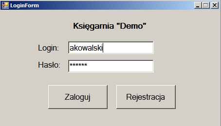
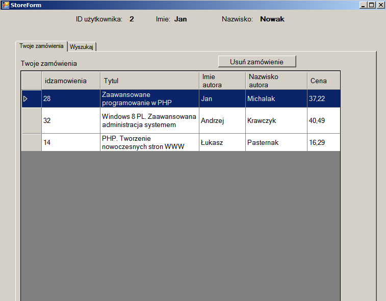
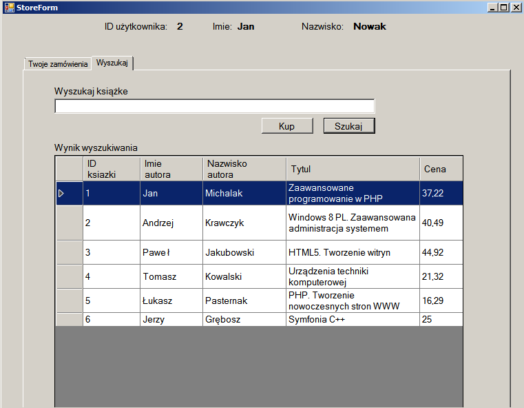
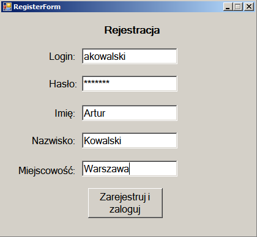

# Introduction

The program presents a simple bookstore using a local MySql database.
The program has a login and registration window. After logging in, 
a window appears in which the books ordered by us are presented and
 a tab in which we can search for a book and buy it.

# Appearance of the program  
 _Login window_
   
 
  _Store window_
   
 
  _Search books_
   
 
 _Registration window_
   
